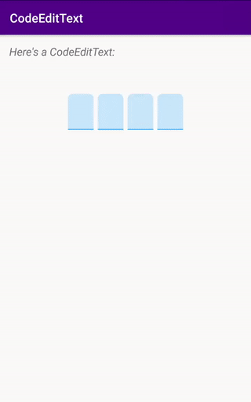
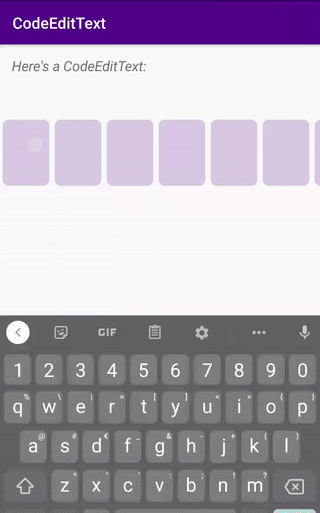
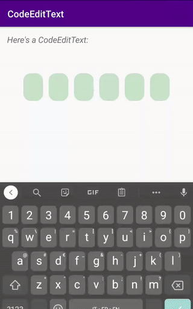
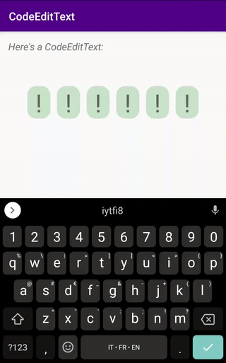

CodeEditText
===============

[](https://opensource.org/licenses/Apache-2.0) [](http://developer.android.com/index.html) [](https://android-arsenal.com/api?level=16) [](https://jitpack.io/#lukelorusso/CodeEditText)

## Presentation ##

This is the source code of an Android library: `-=:[ CodeEditText ]:=-`

📃 Check also the [**Medium article**](https://blog.prototypr.io/android-codeedittext-a-custom-edittext-tailor-made-for-code-and-password-input-27719cfe28e6?source=friends_link&sk=611e21eba68ff9d095b5e2aad1a6535e) about it!

- - -

## Why would you need it? ##

*"Input codes easily, numbers or alphabetical, long or short, visible or masked, shown as you like!"*  

**Introducing a fancy and highly customizable EditText, redesigned for codes input.**

What you got:
- chose the max length
- use it with any inputType
- you can mask your input AND choose the character you want to mask it
- customize the layout as you like
- horizontal scroll with auto-focus while typing
- and much more!







- - -

## How to use it? ##

Step 1. add the JitPack repository to your ROOT build.gradle at the end of repositories:

```groovy
	allprojects {
		repositories {
			...
			maven { url 'https://jitpack.io' }
		}
	}
```

Step 2. add the dependency:

```groovy
    implementation 'com.lukelorusso:codeedittext:1.1.0'
```  

That's it!

Now you can add the view to your layout:
```xml
<com.lukelorusso.codeedittext.CodeEditText
        android:id="@+id/cetMyCode"
        android:layout_width="wrap_content"
        android:layout_height="wrap_content" />
```  

maybe add some attributes... here you got some, we'll discuss them later
```
        ...
        android:inputType="text"
        android:maxLength="6"
        android:text="09af"
        app:cet_codeMaskChar="#"
        app:cet_codePlaceholder="•"
        app:cet_maskTheCode="true"
        app:cet_scrollDurationInMillis="300"
        ...
```  

All of them can be also set programmatically.

## For Java projects ##

Someone experienced this `InflateException`. For those guys, it's worth noticing that this is a KOTLIN library! The reason why you're getting an `InvocationTargetException` is because, in case you're still on Java, you also have to specify:

```gradle
implementation 'org.jetbrains.kotlin:kotlin-stdlib:1.3.+'
// or one of the -jre7, -jre8 stdlib depending on your config
// put the most up-to-date version
```

on your app module's `build.gradle`.

Another solution is just to... migrate to Kotlin guys!

- - -

# Customization #

## Attributes ##

To set your code programmatically:
```kotlin
cetMyCode.text = "1234"
```

...and the same thing for the maxLength:
```kotlin
cetMyCode.maxLength = 6
```

If the input layout is too big for the screen, it will become scrollable and will automatically focus on the portion of the code where the user is typing.

To change the duration of the scrolling effect (in milliseconds):
```kotlin
cetMyCode.scrollDurationInMillis = 300
```

The default inputType for the EditText is `"number"`. Do you need another one?
```kotlin
cetMyCode.inputType = InputType.TYPE_CLASS_TEXT // choosing a password type will not mask the input
```

To mask the input (the "password" scenario) just set this boolean:
```kotlin
cetMyCode.maskTheCode = true
```

If you don't like dots:
```kotlin
cetMyCode.codeMaskChar = '#' // or whatever other Char you like :)
```

You can also specify a placeholder for the empty char:
```kotlin
cetMyCode.codePlaceholder = '•' // or whatever other Char you like :)
```

## Callbacks ##

For your convenience, here's how you intercept the code:
```kotlin
cetMyCode.setOnCodeChangedListener { (code, completed) ->
    // the code has changed
    if (completed) {
        // the code has been fully entered (code.length == maxLength)
    }
}
```

## Design ##

As an example, you can find a custom [**item_code_edit_text.xml**](/codeedittext-example/src/main/res/layout/item_code_edit_text.xml) inside the `res/layout` folder of `codeedittext-example` project.

This is the layout of a single character and it's ENTIRELY CUSTOMIZABLE! You can modify it as you wish; just remember to keep the `TextView`'s id unchanged 😉

Just copy it to your `res/layout` folder and start to change dimensions, text's size, colors or even add more stuff... it's all up to you!

- - -

# Explore! #

Feel free to checkout and launch the example app 🎡

- - -

# Copyright #

Make with 💚 by [Luca Lorusso](http://lukelorusso.com), licensed under [Apache License 2.0](http://www.apache.org/licenses/LICENSE-2.0)  
Thanks for the help to [Lopez Mikhael](http://mikhaellopez.com/)
